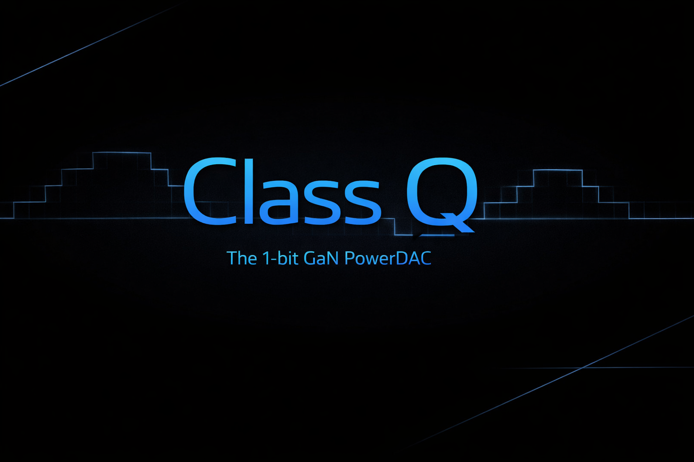

  

  <strong>Class Q — The Open Standard for 1‑Bit Audio and GaN PowerDAC Architecture</strong>

# ClassQ
The official open standard for Class Q — a 1‑bit GaN PowerDAC architecture and unified audio ecosystem spanning file formats, transport, DSP, timecode, broadcast, and power conversion.

# Class Q — The Open Standard for 1‑Bit Audio and GaN PowerDAC Architecture

Class Q is a new category in power conversion and audio system design.

It is not a refinement of Class‑D.
It is not an amplifier topology.
It is a **1‑bit GaN PowerDAC**, where the power stage *is* the DAC.

Class Q defines a unified, generation‑proof architecture for post‑PCM audio, spanning:

- 1‑bit file formats (Q‑DSD)
- 1‑bit transport (Q‑Link)
- GPU‑native oversampled DSP (Q‑Core)
- Plugin API for continuous‑time processing (Q‑DSP)
- SMPTE‑compatible high‑resolution timecode (Q‑Time)
- Broadcast and streaming format (Q‑Stream)
- Blu‑ray‑class archival format (Q‑Disc)
- Class Q GaN power stages (Q‑Amp)
- DSD‑over‑5 GHz monitoring (Q‑IEM)
- Studio architecture (Q‑Studio)
- Live venue architecture (Q‑Venue)
- Optional artist‑protective DRM (Q‑DRM)

Class Q is open source, royalty‑free, and vendor‑neutral.  
It is designed to last for generations.

This repository contains the official specifications, reference implementations, governance documents, and examples that define the Class Q Open Standard.

---

## Status

Draft v0.1 — under active development.

---

## Repository Structure
specs/        → Formal specifications for each subsystem
reference/    → Minimal reference implementations
foundation/   → Governance, charter, roadmap
examples/     → Example Q‑DSD files, Q‑Link configs, session

---

## License

This project is licensed under the **Apache License 2.0**, ensuring open, safe, and universal adoption across hardware, software, and research communities.

---

## Contributing

Class Q is an open standard.  
We welcome contributions from engineers, researchers, manufacturers, studios, venues, and developers.

See **CONTRIBUTING.md** for guidelines.

---

## Vision

Class Q is the foundation of a post‑PCM world — a unified, clock‑coherent architecture for studios, live venues, broadcast, and archival.  
It is designed to be simple, deterministic, scalable, and future‑proof.

A new class for a new generation.
